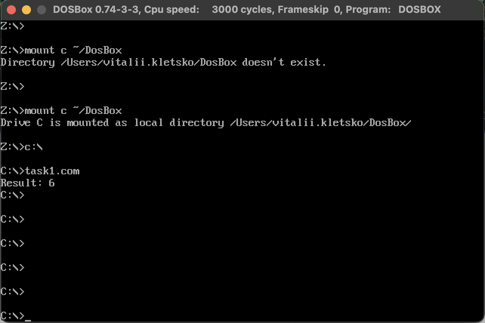

# goit-cs-hw-01

### Computer Systems and Their Fundamentals

### Master of degree from university

### Візуалізація

## Завдання1

```bash
cd src/
nasm -f bin -o task1.com task1.asm
```

DosBox Output:


